This document is about understanding how decompress the kernel and load it into memory and execute it. We build the qemu arm image by following the steps given https://github.com/Abhishekojha38/yocto-playground.git.

After building the image we will launch qemu with the following command.

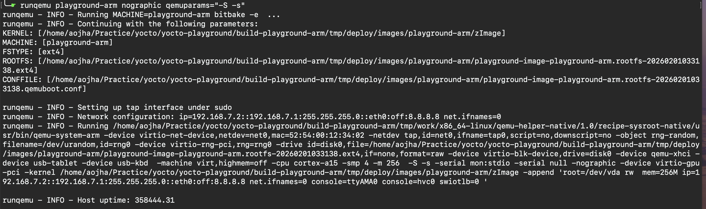

Now QEMU is waiting for the GDB connection. We will connect to it using the following command.

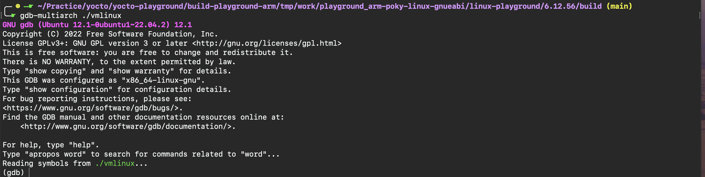

Connect the gdb to qemu by executing the following command in gdb 

```bash
target remote :1234
```

* Here loading address is 0x40000000 and we will try to display the memory at this address.

```bash
0x40000010: .word  <machine_type or 0>
0x40000014: .word  <dtb_phys_addr>
0x40000018: .word  <kernel_entry_point>
```

[cols="1,3", options="header"]
|===
| Register | Meaning

| r0
| Must be 0

| r1
| Machine ID (old) **or 0**

| r2
| Physical address of DTB

| pc
| Jump to kernel entry
|===


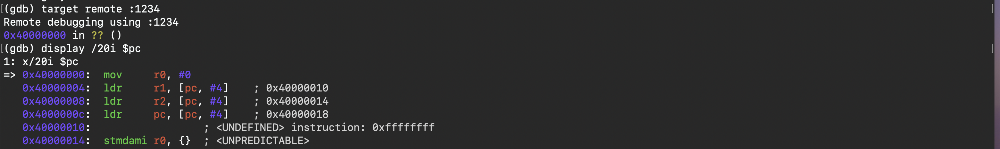

```bash
ldr     pc, [pc, #4]    ; 0x40000018
```

Current instruction address = 0x40000010
pc = 0x40000010 + 8
pc = 0x40000018   ✅

This we can see in below image.

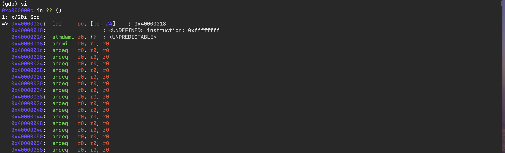

image::../images/move-pc-to-next-inst-2.png[]

`0x40010000` is the `.text` section of the kernel. Now we can see nops instructions which is the start of head.S file. 
https://git.kernel.org/pub/scm/linux/kernel/git/torvalds/linux.git/tree/arch/arm/boot/compressed/head.S#n188

For a compressed kernel, execution begins at the `start` symbol in `arch/arm/boot/compressed/head.S`. This entry point starts with several `NOP` instructions for legacy reasons, skips over magic numbers, and saves the pointer to the ATAGs/DTB. The decompression routine then executes directly from the physical address where the kernel was loaded into memory.

I think we should also look into the vmlinux to understand the process in more detail. Lets see sections and disassembly of vmlinux.

*vmlinux sections*

image::../images/vmlinux-sections.png[

*vmlinux disassembly*

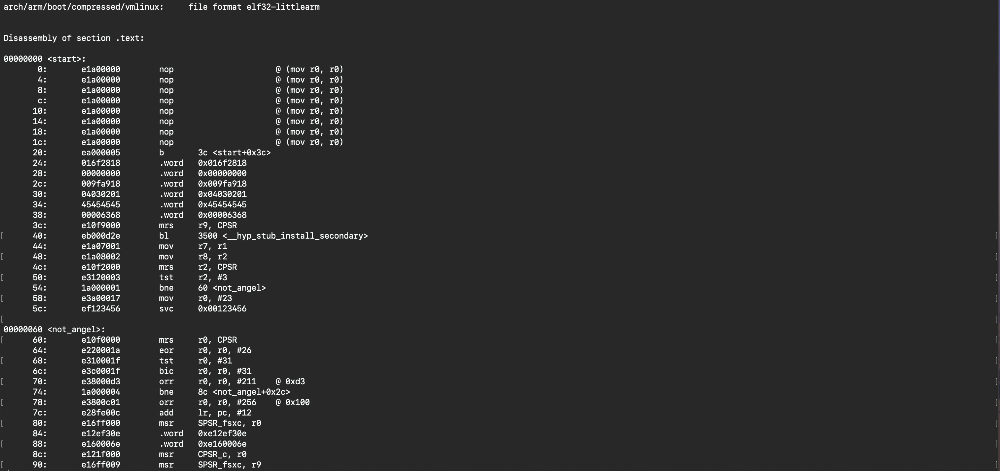

To get more details info we will load the vmlinux at the right location which is our .text section.

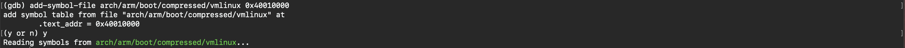

Wow! symbols are loaded successfully.

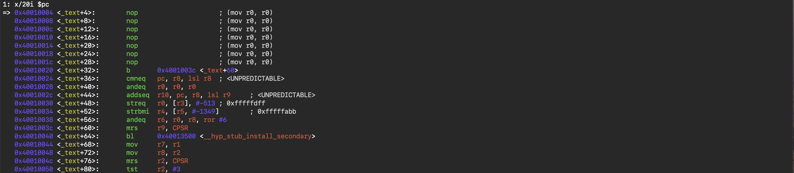

Execute next instructions till we reach to the instruction which saves the ATAGS and Arch ID

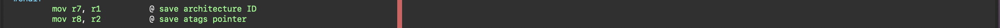

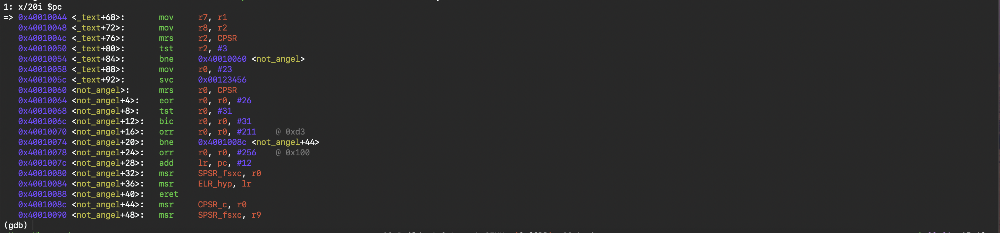

Display R1 and r2 register values to see the ATAGS and Arch ID.

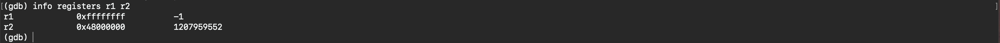

`safe_svcmode_maskall r0`  This macro is intended for forcing the CPU into SVC mode at boot time.

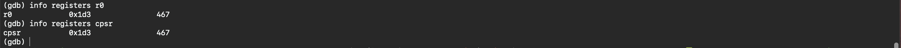

```bash
0x1d3 = 0000 0000 0000 0000 0000 0001 1101 0011
                                   ^^^^^
                                   1 1101 0011

0x1d3 & 0x1f = 0x13 -> Supervisor (SVC) mode
0x1d3 & 0xc0 = 0xc0 -> IRQ and FIQ disabled
State ARM
NZCV flags are set to 0
```

After saving the ATAGS and Arch ID, we will execute the decompression routine.So now the kernel decompression code is executing from the physical address of the physical memory where it was loaded.

The decompression code then locates the start of physical memory. On most modern platforms this is done with the Kconfig-selected code AUTO_ZRELADDR, which means a logical AND between the program counter and 0xf8000000. This means that the kernel readily assumes that it has been loaded and executed in the first part of the first block of physical memory.

*Find the start of physical memory*

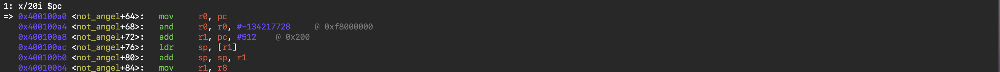

The kernel image is loaded somewhere in physical memory, often by a bootloader (U-Boot, or in some old systems, Angel).
The kernel doesn’t know the exact load address yet.
But it needs a base address for:
Setting up the stack (sp)
Copying itself to the proper location
Accessing global data and relocation info
So early boot uses PC-relative addressing to calculate a safe “kernel base” address.

When the ARM kernel is first entered, it doesn’t yet know:

* Where physical memory starts
* Where it has actually been loaded in RAM

The decompression code needs a base address to work from, because it will eventually:

* Copy itself to the right place
* Set up the stack
* Jump into C code

```bash
0xf8000000 = 1111 1000 0000 0000 0000 0000 0000 0000
Top 5 bits = physical memory block
Lower 27 bits = offset within the block
```
*So pc & 0xf8000000 keeps the first 32MB-aligned block of memory*

*Example*
Suppose kernel is loaded at:
PC = 0x400100a4
Compute:
0x400100a4 & 0xf8000000 = 0x40000000
0x40000000 → kernel base address
All PC-relative offsets can now be computed from here safely.

*Why not smaller or bigger mask?*
Mask smaller (e.g., 0xff000000): too coarse → may include multiple 16MB blocks, kernel could be misaligned
Mask bigger (e.g., 0xffff0000): too fine → might assume kernel is already at exact address → less flexible
0xf8000000 is a sweet spot:
First 32MB block
Covers kernel + decompression buffer + early data structures
Works on most platforms supported by early ARM Linux


We have the kernel base address now. Next step is to add the TEXT_OFFSET to it to get the kernel base address.
Then the TEXT_OFFSET is added to the pointer to the start of physical memory. As the name says, this is where the kernel .text segment (as output from the compiler) should be located. The .text segment contains the executable code so this is the actual starting address of the kernel after decompression. The TEXT_OFFSET is usually 0x8000 so the kernel will be located 0x8000 bytes into the physical memory. This is defined in arch/arm/Makefile.

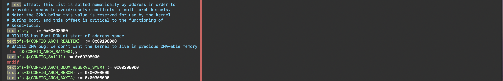

This snapshot is from arch/arm/Makefile. TEXT_OFFSET is 0x8000 by default

The 0x8000 (32KB) offset is a convention, because usually there is some immobile architecture-specific data placed at 0x00000000 such as interrupt vectors, and many elder systems place the ATAGs at 0x00000100. There also must be some space, because when the kernel finally boots, it will subtract 0x4000 (or 0x5000 for LPAE) from this address and store the initial kernel page table there.

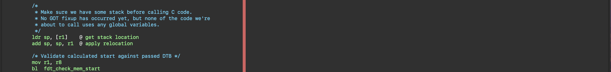

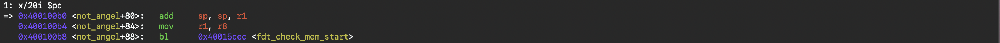

```bash
add r1, pc, #512    @ r1 = PC + 0x200
ldr sp, [r1]         @ sp = [r1]
add sp, sp, r1       @ sp = sp + r1
```
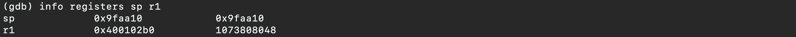

At this point in GDB, we have just done the ldr sp, [r1], but not yet the relocation (add sp, sp, r1)
That’s why SP = 0x009fb680 → it is the offset read from memory, not the final absolute address.

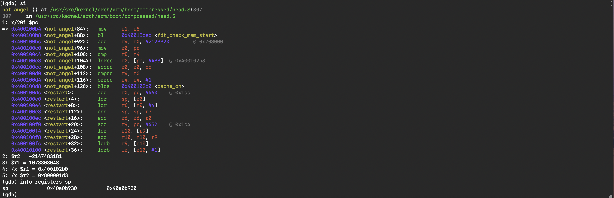

Now we have the final absolute address of the stack.

```bash
sp_final = 0x00a0b680 + 0x400102b0
         = 0x40a0b930
```

Next we check if we would overwrite the compressed kernel with the uncompressed kernel. That would be unfortunate. If this would happen, we check where in the memory the uncompressed kernel would end, and then we copy ourselves (the compressed kernel) past that location.

Then the code simply does a trick to jump back to the relocated address of a label called restart: which is the start of the code to set up the stack pointer and malloc() area, but now executing at the new physical address.

This means it will again set up the stack and malloc() area and look for the appended DTB and everything will look like the kernel was loaded in this location to begin with. (With one difference though: we have already augmented the DTB with ATAGs, so that will not be done again.) This time the uncompressed kernel will not overwrite the compressed kernel.

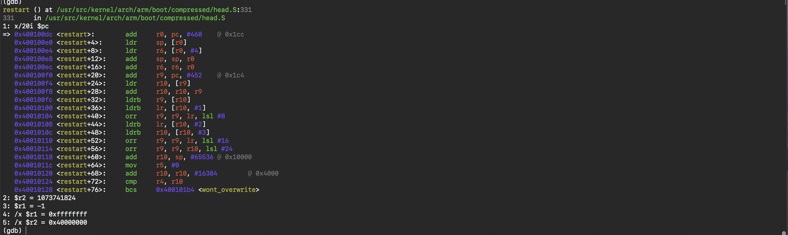

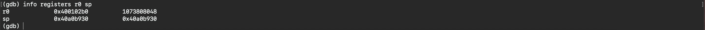

```bash

          /* malloc space is above the relocated stack (64k max) */                                                                                                                                         
          add r10, sp, #MALLOC_SIZE  
```

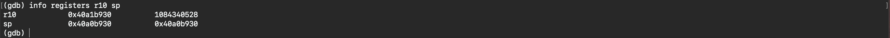