= ARM32 Early Boot: the MMU setup
:doctype: article
:toc: left
:toclevels: 4
:toc-title: Table of Contents
:sectnums:
:sectnumlevels: 4
:icons: font
:source-highlighter: rouge
:rouge-style: github
:imagesdir: images
:experimental:
:xrefstyle: short

In this post I will discuss initial mmu setup happens after the kernel is decompressed and before it jumps to the generic kernel code.

Source:    https://elixir.bootlin.com/linux/v6.1.128/source/arch/arm/boot/compressed/head.S

---
== Basic ARM32 MMU concepts

The ARM mmu can be used in many different ways.

In the most general case it is a 2 level MMU with 4k pages (as an example). This is how something like the Linux operating system might use it.

The way QEMU emulated ARM32 uses it is as a 1 level MMU with 1M "sections". QEMU's aim is to make it transparent and forget about it. You might ask, "why not just turn it off entirely", but as near as I can tell that will not allow caches to be enabled. Also mapping as much of the address space as possible "invalid" will catch certain bugs.

=== Translation table

The translation table must begin on a 16K boundary. When a virtual address needs to be translated, the top 12 bits of that address select the first level entry in the translation table. Hence each first level entry deals with 1M of the virtual address space. Each entry is 32 bits in size.
There are 4 types of table entries as indicated by the low 2 bits of the entry:

00 - unmapped (access will give a translation fault).
01 - coarse 2nd level table
10 - section descriptor
11 - fine 2nd level table

[NOTE]
====
head.s uses 10 - section descriptor for mapping the memory.
====

== ARM32 boot context

Physical to virtual address mapping as per the head.S file

The diagram shows the complete identity mapping (VA = PA) that __setup_mmu builds across both address spaces side by side. A few things to note:

* The solid teal arrows through the RAM window are the active, cacheable mappings — every 1 MB section in that region gets a ...c0e descriptor and is fully accessible by the decompressor once the MMU turns on.
* The dashed arrows on the gray and amber regions carry the same VA = PA identity but with strongly-ordered attributes (...c12) — the CPU can still address them, but no cache fill happens and no speculative execution is permitted (XN=1).
* The two amber strips at 0x40200000 and 0x50200000 are the rounding artefacts: sections where the 1 MB-aligned descriptor value falls just across the r9/r10 threshold when the full 32-bit value is compared, creating a one-section slip at each boundary. The lower one is physically DRAM mapped non-cached; the upper one is mapped cached ~1 MB past the true RAM end. Both are harmless for the decompressor's purposes.

=== Where execution begins

After the compressed kernel is decompressed, control passes to the physical
address of `stext` in `arch/arm/kernel/head.S`.  At this point the CPU is
running entirely in physical memory — MMU off, caches off, no page tables.

The very first task is to build a minimal translation table, load it into the
MMU hardware registers, then switch the program counter from a physical address
to a virtual address.  Everything described in this document happens in that
window.

=== Virtual memory split

The kernel is compiled to execute in a configurable virtual address range
controlled by `PAGE_OFFSET`:

[cols="1,1,2", options="header"]
|===
| Kconfig symbol | `PAGE_OFFSET` | Kernel virtual range

| `VMSPLIT_1G`
| `0x40000000`
| `0x40000000`–`0xFFFFFFFF`

| `VMSPLIT_2G`
| `0x80000000`
| `0x80000000`–`0xFFFFFFFF`

| `VMSPLIT_3G_OPT`
| `0xB0000000`
| `0xB0000000`–`0xFFFFFFFF`

| _(default)_
| `0xC0000000`
| `0xC0000000`–`0xFFFFFFFF`
|===

The most common split is `0xC0000000`: 1 GB of kernel virtual space, 3 GB for
userspace.  The kernel is compiled to execute at
`KERNEL_RAM_VADDR = PAGE_OFFSET + TEXT_OFFSET` (typically `0xC0008000`).

=== `swapper_pg_dir` — the initial page table

The initial page table lives at `KERNEL_RAM_VADDR - PG_DIR_SIZE`.  For classic
ARM MMU this is `0xC0008000 - 0x4000 = 0xC0004000` in virtual memory.  At the
corresponding physical offset (e.g. `0x40204000` in this debug session) this
16 KB region holds 4096 first-level section descriptors covering the entire
4 GB address space.

[NOTE]
====
`swapper_pg_dir` is a *temporary* structure.  It is abandoned once the kernel's
virtual memory manager builds a full, accurate page table hierarchy.
====

=== Call chain leading to `__setup_mmu`

[source]
----
stext                           (arch/arm/kernel/head.S)
  └─ __create_page_tables
       └─ __armv7_mmu_cache_on
            └─ __setup_mmu       ← this document
----

`__armv7_mmu_cache_on` detects whether the CPU implements VMSA (the standard
paged MMU), sets up the RAM attribute register `r6`, then branches to
`__setup_mmu`:

[source,armasm]
----
__armv7_mmu_cache_on:
    enable_cp15_barriers  r11
    mov   r12, lr
#ifdef CONFIG_MMU
    mrc   p15, 0, r11, c0, c1, 4    @ read ID_MMFR0
    tst   r11, #0xf                  @ VMSA capable?
    movne r6, #CB_BITS | 0x02       @ r6 = RAM attrs: C|B + !XN (= 0x0e)
    blne  __setup_mmu                @ build the page table
----

`r6` is the key hand-off value.  `CB_BITS` evaluates to `0x0C` (C=1, B=1),
so `r6 = 0x0E` — exactly the `...c0e` suffix seen in the GDB dumps for RAM
entries.

---

== ARM32 first-level descriptor format

Reference: https://developer.arm.com/documentation/ddi0406/b/

Each 32-bit entry in the first-level translation table is one of four types,
selected by bits `[1:0]`:

[cols="1,1,3", options="header"]
|===
| `bits[1:0]` | Type | Meaning

| `0b00`
| Fault / invalid
| Access generates a Translation fault.  Bits `[31:2]` are ignored by hardware.

| `0b01`
| Page table
| Points to a 1 KB second-level table for 4 KB / 64 KB page mapping.

| `0b10`
| Section / Supersection
| Direct 1 MB (Section) or 16 MB (Supersection) flat mapping.
  Bit `[18]` selects between them.

| `0b11`
| Reserved
| Always generates a Translation fault in VMSAv7.
|===

=== Section descriptor bit layout

[source]
----
 31        20 19  18 17 16 15  14    12 11  10  9  8      5  4  3  2  1  0
 ┌──────────┬───┬───┬──┬──┬──┬───────┬───────┬──┬─────────┬──┬──┬──┬──┬──┐
 │PA[31:20] │NS │ 0 │nG│ S│AP[2]│TEX[2:0]│AP[1:0]│IMP│Domain│XN│ C│ B│ 1│ 0│
 └──────────┴───┴───┴──┴──┴──┴───────┴───────┴──┴─────────┴──┴──┴──┴──┴──┘
----

[cols="1,3", options="header"]
|===
| Field | Purpose

| `PA[31:20]`
| Physical base address of the mapped 1 MB section.

| `NS`
| Non-secure bit (Security Extensions only).

| `nG`
| Not-global — TLB entry tagged with ASID; only valid for current process.

| `S`
| Shareable — region is shared between multiple processors.

| `AP[2], AP[1:0]`
| Access Permissions.  Deprecated encoding `APX=0, AP=0b11` = full PL0+PL1 R/W.

| `TEX[2:0]`
| Type Extension — combined with C and B to encode the full memory type.

| `XN` (bit 4)
| Execute-Never.  Set = no instruction fetch permitted from this region.

| `C` (bit 3)
| Cacheable.

| `B` (bit 2)
| Bufferable.

| `[1:0]`
| `0b10` = this is a Section descriptor.
|===

=== The two descriptor suffixes seen in GDB

[cols="1,1,1,1,1,1", options="header"]
|===
| Suffix | XN (bit 4) | C (bit 3) | B (bit 2) | Memory type | Used for

| `...0c12`
| 1 (set)
| 0
| 0
| Strongly ordered
| Non-RAM: no cache, no buffer, not executable

| `...0c0e`
| 0 (clear)
| 1
| 1
| Normal, cacheable + bufferable
| RAM window: full cache + buffer, executable
|===

---

== `__setup_mmu` — annotated source

[source,armasm]
----
__setup_mmu:
    sub   r3, r4, #16384        @ r3 = r4 - 16 KB  (page-directory base candidate)
    bic   r3, r3, #0xff         @ \
    bic   r3, r3, #0x3f00       @  } align r3 DOWN to nearest 16 KB boundary

    /*
     * Initialise the page tables, turning on cacheable and bufferable
     * bits for the RAM area only.
     */
    mov   r0, r3                @ r0 = write pointer (starts at table base)
    mov   r9, r0, lsr #18       @ strip low 18 bits
    mov   r9, r9, lsl #18       @ r9 = RAM start (256 MB-aligned approximation)
    add   r10, r9, #0x10000000  @ r10 = r9 + 256 MB (assumed RAM end)
    mov   r1, #0x12             @ descriptor template: bits[1:0]=10 (Section)
                                @                      bit[4]=1    (XN)
    orr   r1, r1, #3 << 10     @ AP[11:10] = 0b11 (full access: PL0+PL1 R/W)
    add   r2, r3, #16384        @ r2 = one-past-end of table (loop sentinel)

1:  cmp   r1,  r9              @ carry CLEAR if r1 < r9 (below RAM)
    cmphs r10, r1              @ carry CLEAR if r10 <= r1 (at/above RAM end)
    @   LO (C=0) → outside [r9, r10) → non-RAM
    @   HS (C=1) → inside  [r9, r10) → RAM

    bic   r1, r1, #0x1c        @ clear bits[4:2]: XN | C | B
    orrlo r1, r1, #0x10        @ non-RAM: restore XN (bit 4)
    orrhs r1, r1, r6           @ RAM: apply C/B/TEX from r6 (= 0x0e)

    str   r1, [r0], #4         @ store descriptor, advance r0 by 4
    add   r1, r1, #1048576     @ r1 += 1 MB (PA base + value both advance)
    teq   r0, r2               @ reached end of table?
    bne   1b

    /*
     * If running from Flash: cache the execution region too.
     * Map 2 MB so there is no overlap hazard for a 1 MB compressed kernel.
     * If running from RAM: this duplicates the above — harmless.
     */
    orr   r1, r6, #0x04        @ RAM attrs from r6, force B=1
    orr   r1, r1, #3 << 10     @ AP=11
    mov   r2, pc               @ capture current PC
    mov   r2, r2, lsr #20      @ r2 = 1 MB section index of current PC
    orr   r1, r1, r2, lsl #20  @ embed section base into descriptor
    add   r0, r3, r2, lsl #2   @ r0 → table slot for PC's section
    str   r1, [r0], #4         @ patch PC's 1 MB entry
    add   r1, r1, #1048576     @ advance 1 MB
    str   r1, [r0]             @ patch PC+1 MB entry
    mov   pc, lr               @ return to __armv7_mmu_cache_on
ENDPROC(__setup_mmu)
----

---

== Phase-by-phase analysis

=== Phase 1 — Locate the page-table base

[source,armasm]
----
sub   r3, r4, #16384    @ r4 = end of compressed-image allocation
bic   r3, r3, #0xff     @ \
bic   r3, r3, #0x3f00   @  } clear low 14 bits → align to 16 KB
----

The ARM MMU requires the first-level table to be aligned to a 16 KB boundary.
Subtracting 16384 from `r4` and masking the low 14 bits produces a valid,
aligned base address for the 4096 × 4-byte = 16 KB table.

[source,gdb]
----
(gdb) info registers r3 r4
r3 = 0x40204000    @ page-table base (aligned to 16 KB)
r4 = 0x40208000    @ end of allocation
----

=== Phase 2 — Compute the RAM window

[source,armasm]
----
mov   r0, r3                @ r0 = write pointer
mov   r9, r0, lsr #18       @ \
mov   r9, r9, lsl #18       @  } mask off low 18 bits → 256 MB-aligned base
add   r10, r9, #0x10000000  @ r10 = r9 + 256 MB
----

Shifting right then left by 18 is a bitwise AND with `~0x3FFFF`, which rounds
the page-table base address down to the nearest 256 MB boundary.  Because the
kernel is loaded at a 16 MB-aligned physical address, this reliably captures
the start of the DRAM bank.

[source,gdb]
----
(gdb) info registers r9 r10
r9  = 0x40204000    @ RAM window start
r10 = 0x50204000    @ RAM window end  (r9 + 256 MB)
----

[NOTE]
====
The 256 MB window is a *conservative estimate*, not the true DRAM size.
Its only purpose is to give the decompressor a workable cached region.
The real memory map is built later by `__create_page_tables` in
`arch/arm/kernel/head.S`.
====

=== Phase 3 — Initialise the descriptor template

[source,armasm]
----
mov   r1, #0x12         @ 0b0001_0010: [1:0]=10 Section, bit[4]=1 XN
orr   r1, r1, #3 << 10  @ AP[11:10] = 0b11 (full access, deprecated encoding)
add   r2, r3, #16384    @ r2 = loop sentinel (one-past-end of table)
----

`r1` starts as `0x00000c12`.  Because bits `[31:20]` encode the physical base
address of a section descriptor, adding `0x100000` (1 MB) each iteration
simultaneously advances both the PA in the descriptor and the value being
compared against `r9`/`r10`.

[source,gdb]
----
(gdb) info registers r1 r2 r0
r1 = 0x00000c12    @ initial descriptor template
r2 = 0x40208000    @ loop sentinel
r0 = 0x40204000    @ write pointer (= r3)
----

=== Phase 4 — Main mapping loop

[source,armasm]
----
1:  cmp   r1,  r9       @ C=0 if r1 < r9
    cmphs r10, r1       @ C=0 if r10 <= r1  (only tested when C was set)
    bic   r1, r1, #0x1c @ clear XN | C | B
    orrlo r1, r1, #0x10 @ non-RAM: set XN, leave C/B = 0
    orrhs r1, r1, r6    @ RAM: OR in r6 (0x0e: C=1, B=1, XN=0)
    str   r1, [r0], #4  @ write descriptor, post-increment r0
    add   r1, r1, #1048576
    teq   r0, r2
    bne   1b
----

==== The dual-purpose `r1` idiom

`r1` is simultaneously the section descriptor being written and the probe value
tested against the RAM window.  This works because bits `[31:20]` carry the
PA base in both contexts — incrementing by `0x100000` is valid for both.

==== Condition-code logic

[source]
----
cmp   r1, r9       → if r1 < r9:  C=0  (LO — below window)
cmphs r10, r1      → only runs if C=1
                   → if r10 <= r1: C=0  (LO — above window)

Final conditions:
  LO → r1 < r9  OR  r1 >= r10  → outside [r9, r10) → non-RAM
  HS → r9 <= r1 < r10           → inside  [r9, r10) → RAM
----

[IMPORTANT]
====
The comparison uses the *full 32-bit r1* including the low `0xc12` attribute
bits — not just the PA base.  This creates a 1 MB rounding artefact at both
boundaries of the RAM window.
====

=== Phase 5 — Flash / execution-context fixup (epilogue)

[source,armasm]
----
orr   r1, r6, #0x04        @ r6 = 0x0e, force B bit → r1 = 0x0e | 0x04 = 0x0e
orr   r1, r1, #3 << 10     @ AP=11
mov   r2, pc               @ current PC
mov   r2, r2, lsr #20      @ 1 MB section index
orr   r1, r1, r2, lsl #20  @ descriptor = RAM attrs + section base
add   r0, r3, r2, lsl #2   @ table slot = base + index * 4
str   r1, [r0], #4         @ patch section containing PC
add   r1, r1, #1048576
str   r1, [r0]             @ patch next 1 MB section
mov   pc, lr
----

This epilogue overwrites the two table entries that cover the currently
executing code with full RAM attributes.  It is necessary when the decompressor
is running from NOR Flash (outside the `[r9, r10)` window) — without this
patch those entries would carry `...c12` (non-cached, non-executable) and the
CPU could not execute from them after the MMU is enabled.

---

== Register summary on entry/exit

[cols="1,1,1,2", options="header"]
|===
| Register | Direction | Example value | Purpose

| `r4`
| in
| `0x40208000`
| End of page-table allocation

| `r6`
| in
| `0x0000000e`
| RAM section attributes from `__armv7_mmu_cache_on`

| `lr`
| in
| _(caller's LR)_
| Return address (written to `pc` at end)

| `r3`
| internal
| `0x40204000`
| Aligned page-table base

| `r9`
| internal
| `0x40204000`
| RAM window start

| `r10`
| internal
| `0x50204000`
| RAM window end (r9 + 256 MB)

| `r0`
| internal
| `0x40204000`→`0x40208000`
| Write pointer through table

| `r1`
| internal
| `0x00000c12`→`0xfffffff2`
| Running descriptor (PA base + attributes)

| `r2`
| internal
| `0x40208000`
| Loop sentinel / PC section index (epilogue)
|===

---

== GDB trace — observed page-table dumps

=== Early non-RAM region (`0x40204000`)

[source,gdb]
----
(gdb) x/20xw 0x40204000
0x40204000:  0x00000c12  0x00100c12  0x00200c12  0x00300c12
0x40204010:  0x00400c12  0x00500c12  0x00600c12  0x00700c12
0x40204020:  0x00800c12  0x00900c12  0x00a00c12  0x00b00c12
----

Every entry ends in `...c12`: XN=1, C=0, B=0 — strongly ordered.  PA base
increases by `0x00100000` per slot, confirming identity mapping (VA = PA)
across the entire address space.

=== Lower RAM boundary (`0x40205000`)

Table address `0x40205000` is entry `(0x40205000 - 0x40204000) / 4 = 0x400`,
describing VA/PA `0x40000000` onwards.

[source,gdb]
----
(gdb) x/20xw 0x40205000
0x40205000:  0x40000c12  0x40100c12  0x40200c0e  0x40300c0e
0x40205010:  0x40400c0e  0x40500c0e  0x40600c0e  0x40700c0e
0x40205020:  0x40800c0e  0x40900c0e  0x40a00c0e  0x40b00c0e
0x40205030:  0x40c00c0e  0x40d00c0e  0x40e00c0e  0x40f00c0e
0x40205040:  0x41000c0e  0x41100c0e  0x41200c0e  0x41300c0e
----

[cols="1,1,1,2,3", options="header"]
|===
| Entry | Descriptor | PA | Suffix | Attributes

| 0x400
| `0x40000c12`
| `0x40000000`
| `...c12`
| Non-RAM: XN=1, C=0, B=0

| 0x401
| `0x40100c12`
| `0x40100000`
| `...c12`
| Non-RAM: XN=1, C=0, B=0

| 0x402
| `0x40200c0e`
| `0x40200000`
| `...c0e`
| RAM: XN=0, C=1, B=1 (first cached entry)

| 0x403+
| `0x40300c0e`...
| `0x40300000`...
| `...c0e`
| RAM continues
|===

==== Why the transition falls at `0x40200000`, not `r9 = 0x40204000`

The full-width comparison includes the `0xc12` attribute bits:

[source]
----
r1 = 0x40200c12  →  0x40200c12 < 0x40204000  →  LO → non-RAM → ...c12
r1 = 0x40300c12  →  0x40300c12 > 0x40204000  →  HS → RAM     → ...c0e
----

The `0x40200000` section is physically DRAM but its descriptor value falls
below `r9`, so the loop marks it non-cached.  The epilogue's flash-fixup
subsequently patches it to `c0e` if the decompressor happens to be executing
from that region — which explains why the GDB dump already shows `c0e` at
entry `0x402` even though the loop would have written `c12`.

=== Upper RAM boundary (`0x40205400`)

Table address `0x40205400` is entry `0x500`, describing VA/PA `0x50000000`
onwards.

[source,gdb]
----
(gdb) x/20xw 0x40205400
0x40205400:  0x50000c0e  0x50100c0e  0x50200c12  0x50300c12
0x40205410:  0x50400c12  0x50500c12  0x50600c12  0x50700c12
0x40205420:  0x50800c12  0x50900c12  0x50a00c12  0x50b00c12
0x40205430:  0x50c00c12  0x50d00c12  0x50e00c12  0x50f00c12
0x40205440:  0x51000c12  0x51100c12  0x51200c12  0x51300c12
----

[cols="1,1,1,2,3", options="header"]
|===
| Entry | Descriptor | PA | Suffix | Attributes

| 0x500
| `0x50000c0e`
| `0x50000000`
| `...c0e`
| RAM: XN=0, C=1, B=1

| 0x501
| `0x50100c0e`
| `0x50100000`
| `...c0e`
| RAM: XN=0, C=1, B=1 (last cached entry)

| 0x502
| `0x50200c12`
| `0x50200000`
| `...c12`
| Non-RAM: XN=1, C=0, B=0 (first uncached entry)

| 0x503+
| `0x50300c12`...
| `0x50300000`...
| `...c12`
| Non-RAM to `0xFFFFFFFF`
|===

==== Why the transition falls at `0x50200000`, not `r10 = 0x50204000`

[source]
----
r1 = 0x50200c0e
cmphs r10, r1  →  0x50204000 > 0x50200c0e  →  HS → still RAM → ...c0e

r1 = 0x50300c12  (after bic clears old attrs)
cmphs r10, r1  →  0x50204000 < 0x50300c12  →  LO → non-RAM  → ...c12
----

The `0x50200000` section passes the HS test even though `r10 = 0x50204000` is
only 16 KB into it.  The remaining ~1020 KB (`0x50204000`–`0x502FFFFF`)
receives cached attributes it does not strictly need.  This is harmless —
those addresses are never accessed during early boot.

=== Rounding-artefact summary

[cols="2,1,1,2", options="header"]
|===
| PA section | Loop result | Suffix | Note

| `0x00000000`–`0x401FFFFF`
| Non-RAM
| `...c12`
| Below r9

| `0x40200000`–`0x402FFFFF`
| Non-RAM
| `...c12`
| Descriptor < r9 — physically DRAM, mapped uncached by loop

| `0x40300000`–`0x501FFFFF`
| RAM
| `...c0e`
| Core cached window (~254 MB)

| `0x50200000`–`0x502FFFFF`
| RAM
| `...c0e`
| Descriptor < r10 — over-mapped cached by ~1 MB

| `0x50300000`–`0xFFFFFFFF`
| Non-RAM
| `...c12`
| Above r10
|===

---

== Full 4 GB memory map (post-loop)

[source]
----
Virtual / Physical address space  (r9 = 0x40204000, r10 = 0x50204000)
──────────────────────────────────────────────────────────────────────
0x00000000 ┬─────────────────────────────────────────────────────────
           │  Non-RAM  (...c12)
           │  XN=1, C=0, B=0  —  strongly ordered
           │  identity mapped  (~1 GB)
           │
0x40200000 ├─ lower artefact: descriptor value < r9
0x402FFFFF │  physically DRAM, mapped non-cached by loop
           │  (patched to c0e by epilogue if PC falls here)
           │
0x40300000 ├─────────────────────────────────────────────────────────
           │  RAM  (...c0e)
           │  XN=0, C=1, B=1  —  cacheable + bufferable
           │  identity mapped  (~254 MB core window)
           │
0x50200000 ├─ upper artefact: descriptor value < r10
0x502FFFFF │  16 KB inside true window; ~1 MB over-mapped cached
           │
0x50300000 ├─────────────────────────────────────────────────────────
           │  Non-RAM  (...c12)
           │  XN=1, C=0, B=0  —  strongly ordered
           │  identity mapped  (~3.5 GB)
           │
0xFFFFFFFF ┴─────────────────────────────────────────────────────────
----

---

== MMU enablement — steps after `__setup_mmu` returns

`__setup_mmu` returns to `__armv7_mmu_cache_on`, which then executes a
carefully ordered coprocessor sequence to activate the MMU.

=== Full sequence

[source,armasm]
----
    mov   r0, #0
    mcr   p15, 0, r0, c7, c10, 4    @ DSB — drain write buffer

    tst   r11, #0xf                  @ VMSA capable?
    mcrne p15, 0, r0, c8, c7, 0     @ flush I+D TLBs

    mrc   p15, 0, r0, c1, c0, 0     @ read SCTLR
    bic   r0, r0, #1 << 28          @ clear TRE (direct TEX model)
    orr   r0, r0, #0x5000           @ I-cache (bit 12) + RR replace (bit 14)
    orr   r0, r0, #0x003c           @ write buffer (bits 2–5)
    bic   r0, r0, #2                @ clear A (no unaligned fault)
    orr   r0, r0, #1 << 22          @ set U (ARMv6 unaligned model)

#ifdef CONFIG_MMU
 ARM_BE8(orr r0, r0, #1 << 25)      @ big-endian page tables (BE8 build only)
    mrcne   p15, 0, r6, c2, c0, 2   @ save current TTBCR
    orrne   r0,  r0, #1             @ stage MMU enable: SCTLR bit 0 = 1
    movne   r1,  #0xfffffffd        @ domain 0 = client
    bic     r6,  r6, #1 << 31      @ 32-bit translation (not LPAE)
    bic     r6,  r6, #(7<<0)|(1<<4) @ N=0, PD0=0 → all VAs use TTBR0
    mcrne   p15, 0, r3, c2, c0, 0  @ TTBR0 = page-table base (r3)
    mcrne   p15, 0, r1, c3, c0, 0  @ DACR  = domain 0 client
    mcrne   p15, 0, r6, c2, c0, 2  @ TTBCR = 32-bit, TTBR0 only
#endif

    mcr   p15, 0, r0, c7, c5, 4    @ ISB — flush pipeline
    mcr   p15, 0, r0, c1, c0, 0    @ write SCTLR — MMU NOW ON
    mrc   p15, 0, r0, c1, c0, 0    @ read back (force write completion)
    mov   r0, #0
    mcr   p15, 0, r0, c7, c5, 4    @ ISB — next fetch goes through MMU
    mov   pc, r12                   @ return
----

=== Step-by-step breakdown

==== Step 1 — Drain the write buffer (DSB)

[source,armasm]
----
mov   r0, #0
mcr   p15, 0, r0, c7, c10, 4    @ Data Synchronisation Barrier
----

All buffered writes to the page table must reach physical memory before any
MMU register is loaded.  Without the DSB a pending store to a descriptor could
arrive *after* the MMU has already fetched that entry, causing a translation
from stale data.

`c7, c10, 4` is the CP15 DSB encoding for ARMv6/v7.  It stalls the pipeline
until the write buffer is empty and all cache-line evictions are complete.

==== Step 2 — Flush the TLBs

[source,armasm]
----
tst    r11, #0xf               @ r11[3:0] non-zero → VMSA MMU present
mcrne  p15, 0, r0, c8, c7, 0  @ invalidate I+D TLBs
----

Stale VA→PA translations from an earlier boot stage would produce wrong
results the instant the new page table is active.  `c8, c7, 0` invalidates
both instruction and data TLBs.

==== Step 3 — Configure SCTLR

Read-modify-write on the System Control Register:

[cols="2,1,1,3", options="header"]
|===
| Instruction | Bit(s) | Direction | Effect

| `bic r0, r0, #1<<28`
| TRE (28)
| Clear
| TEX remap disabled — C/B/TEX bits in descriptors used directly.
  Critical: `__setup_mmu` encodes direct TEX; leaving TRE set would
  misinterpret every descriptor.

| `orr r0, r0, #0x5000`
| I-cache (12) + RR (14)
| Set
| Instruction cache on; round-robin replacement policy.

| `orr r0, r0, #0x003c`
| Write buffer (2–5)
| Set
| Write buffer and write-allocate controls enabled.

| `bic r0, r0, #2`
| A (1)
| Clear
| Alignment fault on unaligned accesses disabled.

| `orr r0, r0, #1<<22`
| U (22)
| Set
| ARMv6 hardware unaligned access model.  Required for ARM1176.
|===

==== Step 4 — Load the MMU hardware registers

[cols="1,1,3", options="header"]
|===
| Register | CP15 encoding | Purpose

| `TTBR0`
| `c2, c0, 0`
| Physical address of the page table built by `__setup_mmu` (held in `r3`)

| `DACR`
| `c3, c0, 0`
| Domain 0 = Client — accesses are checked against page-table permissions

| `TTBCR`
| `c2, c0, 2`
| Short-descriptor (32-bit) format; only TTBR0 used (N=0, PD0=0)
|===

`TTBR0` must be written *before* bit 0 of SCTLR is set.  If the MMU turned
on before the page-table pointer was valid, the first TLB miss would attempt
a walk from an uninitialised address.

==== Step 5 — ISB + commit SCTLR + return

[source,armasm]
----
mcr   p15, 0, r0, c7, c5, 4    @ ISB — discard speculative fetches
mcr   p15, 0, r0, c1, c0, 0    @ write SCTLR with bit 0 set — MMU ON
mrc   p15, 0, r0, c1, c0, 0    @ read back (forces write to complete)
mov   r0, #0
mcr   p15, 0, r0, c7, c5, 4    @ ISB — guarantee next fetch uses MMU
mov   pc, r12                   @ return (first instruction translated by MMU)
----

The first ISB flushes any instructions already in the fetch/decode stages that
were brought in before the SCTLR write.

Writing SCTLR with bit 0 set is the single instruction that activates the MMU.
The immediate read-back is a standard ARMv7 idiom to prevent the store from
being merged or reordered across the subsequent ISB.

The second ISB guarantees that `mov pc, r12` — and every instruction after it
— is fetched through the now-active translation table.

=== Why the ordering is mandatory

[source]
----
DSB         → page-table writes visible to hardware before MMU loads them
TLB flush   → no stale translations from previous boot stage
SCTLR bits  → cacheability model correct BEFORE MMU is turned on
TTBR0       → page-table pointer valid BEFORE bit 0 of SCTLR is set
DACR        → domain permissions valid BEFORE first translation walk
TTBCR       → format/range correct BEFORE first translation walk
ISB         → pipeline clean BEFORE SCTLR write
SCTLR write → MMU on — no going back
read-back   → write forced to complete, not merged with later writes
ISB         → next fetch (mov pc, r12) uses the MMU
----

Any reordering of these steps produces undefined behaviour — typically a
prefetch abort or data abort on the very first post-MMU instruction.

---

== End result

After `mov pc, r12` returns, the CPU state is:

* MMU active — every instruction fetch and data access translated via the table
  at physical address `r3` (`0x40204000` in this session).
* Identity mapping in force — VA = PA everywhere, so the program counter value
  does not change meaning as the MMU enables.
* Instruction cache active — fetches from the RAM window are cached.
* Write buffer active — stores to RAM are buffered and reordered.
* Unaligned accesses transparently handled — ARMv6 model.
* TEX remap disabled — descriptors use direct C/B/TEX encoding.

The decompressor now executes from cached memory and can decompress the kernel
at full speed.  Once decompression completes, `__create_page_tables` in
`arch/arm/kernel/head.S` rebuilds this table with accurate RAM extents and
eventually replaces it entirely with `swapper_pg_dir` before branching to
`start_kernel()`.

Reference: https://people.kernel.org/linusw/how-the-arm32-kernel-starts +
Reference: http://kofa.mmto.arizona.edu/kyu/arm101/mmu_regs.html